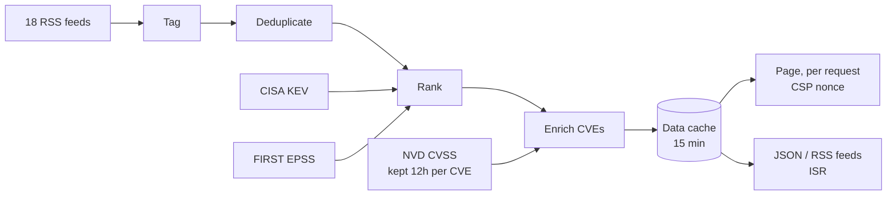

# Cyber Pulse SG

Real-time cybersecurity news, aggregated from trusted sources and ranked by relevance.

Cyber Pulse fetches 18 RSS feeds: government and CERT advisories (CISA, NCSC,
HKCERT), security journalism (Krebs on Security, BleepingComputer, The Hacker
News, Dark Reading, …), APAC news (CyberSecAsia) and vendor threat research
(Unit 42, Cisco Talos, …). Then it:

- **tags** each article with a category (Ransomware, APT, Vulnerability, AI, …)
- **deduplicates** the same story reported by several outlets, keeping the most
  authoritative copy and listing the others under "also"
- **ranks** by source tier, threat keywords, recency, how many outlets report it,
  Singapore relevance and exploitation signals; the top 5 from the last 24 hours
  become Top Stories
- **enriches** CVE IDs with CVSS scores from the NVD, CISA's Known Exploited
  Vulnerabilities (KEV) catalog and FIRST's EPSS exploitation forecast



Article data is refreshed at most every 15 minutes (cached with Next.js's data
cache); pages render per request so each gets a fresh Content-Security-Policy
nonce.

## Features

- Search (press <kbd>/</kbd>), category, time-window and triage filters (Has CVE, KEV,
  CVSS 9+, My stack) with Newest/Top sorting, all shareable via the URL
- **My stack**: save the vendors and products you run; stories that mention them
  are marked on their cards and can be filtered to (stored in the browser)
- Grid/list view, "Load more" pagination
- Keyboard shortcuts: <kbd>/</kbd> search, <kbd>j</kbd>/<kbd>k</kbd> next/previous story
- **NEW** badges for stories published since your last visit, a count of them and
  "Mark all seen"; a notice when new stories mention your stack
- 24h stat tiles (critical and exploited CVEs, breaches, ransomware) that show
  their stories when clicked
- Singapore stories marked **SG** and ranked higher
- Bookmarks (`/saved`) and read tracking, stored in the browser; copy saved stories as a
  text briefing for chat, email or a ticket
- CVE detail dialog with CVSS score, vector, EPSS forecast, KEV status and references
- Trending names and CVEs from the last 24 hours (sidebar on desktop, chip strip on mobile)
- Top Stories capped at two per source; a footer explainer describes the ranking
- Warning banner when two or more feeds fail; if every feed fails, the last good page stays up
- Accessible: keyboard navigable with a skip link, screen-reader labels, reduced-motion support
- Security headers (CSP, frame, referrer, permissions) and hardened feed parsing

## Endpoints

| Path | Description |
| --- | --- |
| `/api/feed.xml` | Ranked articles as RSS 2.0 |
| `/api/feed/kev`, `/api/feed/critical`, `/api/feed/cve` | RSS of only known-exploited, CVSS 9+ or CVE stories (for a reader or chat channel) |
| `/api/feed.json` | Ranked articles as JSON: `{ lastUpdated, count, failedFeeds, featured, recent }` (CORS-enabled); each article's `cves` carry `cvss`, `severity`, `kev` and `epss`/`epssPercentile` where known |
| `/api/health` | Feed health: `{ status, feedsUp, feedsDown, failedFeeds, kev, lastCheck }` (at most ~60s old) |
| `/api/cve/:id` | CVE details from the NVD plus KEV status and EPSS (cached 1h); only CVEs in current stories |

## Development

Requires Node.js 20.9 or later.

```bash
npm install
npm run dev      # http://localhost:3000
npm test         # unit tests (Vitest); npm run test:coverage adds coverage thresholds
npm run test:e2e # end-to-end tests (Playwright) against a local fixture feed
npm run check:feeds # live check that every feed fetches (network; also runs daily in CI)
node scripts/smoke.mjs <url> # smoke-test a deployment (runs after each Production deploy)
npm run lint
npm run build
```

Feed sources and their tiers live in `lib/feeds.ts`; ranking keywords in
`lib/ranker.ts`; category rules in `lib/tagger.ts`. See `CLAUDE.md` for the
architecture and conventions.

## Configuration

All optional:

| Variable | Purpose |
| --- | --- |
| `NVD_API_KEY` | [NVD API key](https://nvd.nist.gov/developers/request-an-api-key); raises new CVE lookups per refresh from 5 to 20, so CVSS coverage fills in faster (scores are kept 12h per CVE) |
| `NEXT_PUBLIC_SITE_URL` | Absolute site URL for feed and canonical links. Defaults to the Vercel production domain |

## Deployment

Deployed on Vercel. GitHub Actions:

- **CI** on every push to `main` and on pull requests: production-dependency
  audit, lint, typecheck, unit tests with coverage thresholds, a production build
  and the Playwright end-to-end suite (with axe accessibility audits)
- **Feed health** daily: every feed must fetch and parse; a failed run flags a
  broken source. Run it by hand with a `feeds` JSON input to vet a new source.
- **Production smoke test** after each Production deploy. Set the repository
  variable `PRODUCTION_URL` to the public domain (deployment URLs are usually
  behind Vercel Authentication, in which case the run is skipped).

Dependabot proposes dependency updates weekly.
